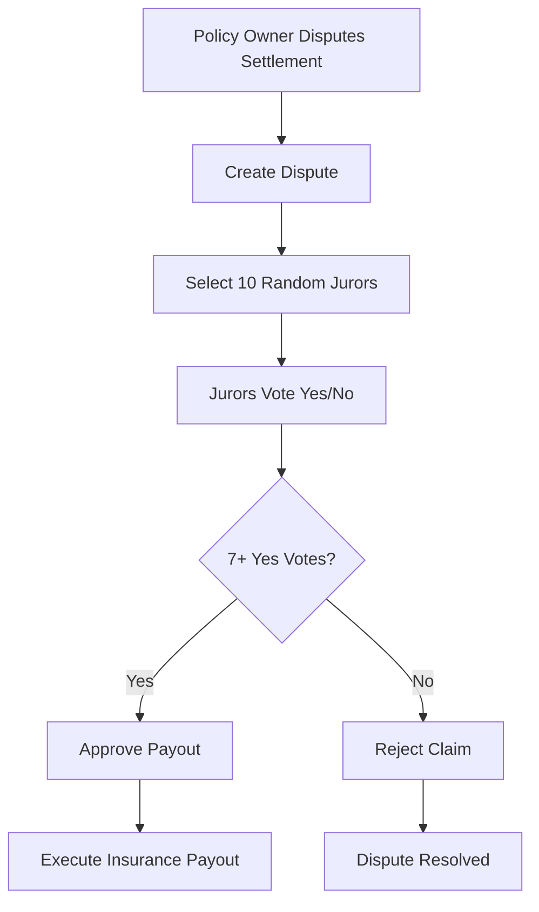

# AgriGuard Dispute Resolution System

A decentralized dispute resolution system for AgriGuard insurance claims using community voting.

## Overview

The Dispute Resolution System allows policy owners to dispute insurance claim settlements through a community voting mechanism. When a dispute is created, 10 randomly selected protocol users (jurors) vote on whether the claim should be paid out.

## Key Features

- **Random Juror Selection**: 10 protocol users are randomly selected for each dispute
- **Community Voting**: Jurors vote Yes/No on disputed claims
- **7-Vote Threshold**: Requires 7+ Yes votes for payout approval
- **Juror Reputation**: Reputation system affects juror selection probability
- **Transparent Process**: All votes and dispute details are recorded on-chain

## Architecture

### Core Components

1. **Dispute Contract** (`dispute_contract.py`)
   - Main dispute resolution logic
   - Handles juror registration and voting
   - Manages dispute lifecycle

2. **ABI Types** (`dispute_abi_types.py`)
   - Type definitions for DisputeData, VoteData, JurorData
   - Ensures proper data serialization

3. **Deployment Config** (`dispute_deploy_config.py`)
   - Network-specific deployment settings
   - Resource allocation configuration

## Dispute Flow



## Functions

### Public Functions

- `register_juror()` - Register as a juror
- `create_dispute(policy_id, reason)` - Create a new dispute
- `vote_on_dispute(dispute_id, vote)` - Vote on a dispute
- `get_dispute(dispute_id)` - View dispute details
- `get_juror_info(address)` - Check juror information

### Admin Functions

- `set_insurance_contract(address)` - Link with insurance contract

## Integration

The dispute system integrates with the main AgriGuard insurance contract through:

1. **Dispute Creation**: Insurance contract calls `dispute_settlement()`
2. **Payout Execution**: Dispute contract calls insurance contract's `oracle_settle()`
3. **Cross-Contract Communication**: Inner transactions for secure communication

## Security Features

- **Owner Verification**: Only policy owners can dispute their claims
- **Single Vote**: Each juror can vote only once per dispute
- **Settlement Validation**: Cannot dispute unsettled policies
- **Reputation System**: Quality voting affects future juror selection

## Deployment

### Prerequisites

1. Deploy the main AgriGuard insurance contract first
2. Deploy the dispute contract
3. Set cross-contract addresses using admin functions

### LocalNet Deployment

```bash
cd /Users/gurubazawada/Desktop/AgriGuard/App/projects/App-contracts
algokit project deploy dispute/dispute_contract.py
```

### Configuration

Update the contract addresses in your application configuration:

```python
# Set dispute contract address in insurance contract
insurance_contract.set_dispute_contract(dispute_contract_address)

# Set insurance contract address in dispute contract
dispute_contract.set_insurance_contract(insurance_contract_address)
```

## Usage Examples

### Register as Juror
```python
# User calls this to become eligible for dispute voting
dispute_contract.register_juror()
```

### Create Dispute
```python
# Policy owner disputes a settlement
dispute_id = insurance_contract.dispute_settlement(policy_id, "Claim amount too low")
```

### Vote on Dispute
```python
# Selected juror votes on the dispute
dispute_contract.vote_on_dispute(dispute_id, 1)  # 1 = Yes, approve payout
```

## Future Enhancements

- **Better Randomness**: Integrate with VRF for true randomness
- **Staking System**: Require jurors to stake tokens
- **Appeal Process**: Multi-level dispute resolution
- **Reward System**: Token rewards for quality jurors
- **Governance**: Community governance for system parameters

## Testing

Run the test suite to verify dispute resolution functionality:

```bash
cd /Users/gurubazawada/Desktop/AgriGuard/App/projects/App-contracts
python -m pytest tests/test_dispute_contract.py
```

## Contributing

When contributing to the dispute system:

1. Ensure all new functions include proper access controls
2. Add comprehensive tests for voting mechanisms
3. Update documentation for any API changes
4. Consider gas optimization for on-chain operations

## License

This dispute resolution system is part of the AgriGuard protocol and follows the same licensing terms.
